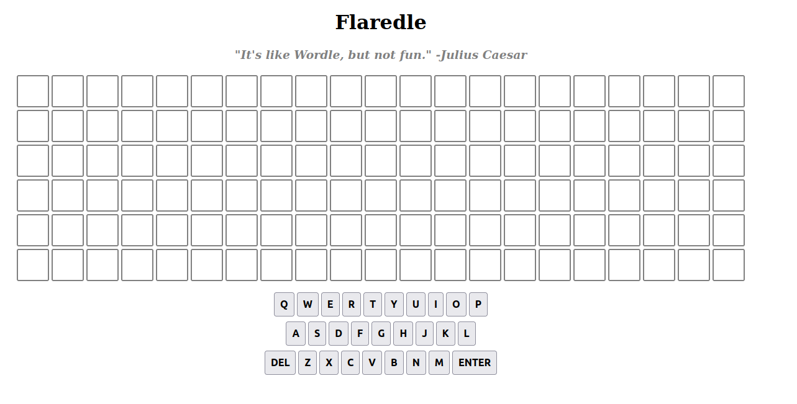
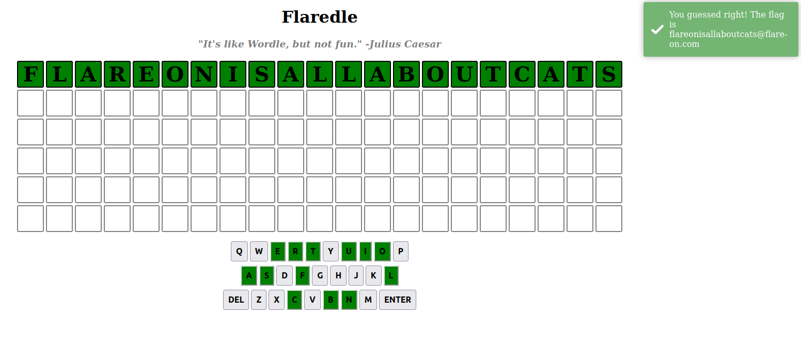

## Introduction

Il y a quelques jours, je suis tombé sur un post Reddit qui demandait comment débuter dans le domaine de la rétro-ingénierie.

Un utilisateur lui a conseillé de commencer par les challenges Flare-On de l'année 2022 car "ils sont plus simples que les années précédentes".

Je vais donc tenter de les faire 😊.

## Le challenge

Ce challenge se compose de 4 fichiers:

- index.html,
- script.js: contient le script du jeu "Flaredle",
- style.css,
- words.js: contient une liste de mots qui est ensuite utilisée par script.js.

Lors de l'ouverture de index.html, j'obtiens cette page.



C'est un clone du jeu Wordle, le but du challenge est donc de trouver le bon mot qui est composé de 21 caractères.

La solution est simple, dans le fichier script.js on trouve ses lignes de code:

```javascript
import { WORDS } from "./words.js";

const CORRECT_GUESS = 57;
let rightGuessString = WORDS[CORRECT_GUESS];
```

La première ligne importe le tableau `WORDS` du fichier words.js, ce tableau regroupe les solutions possibles.

La deuxième ligne, c'est l'index du mot que l'on doit trouver, ici 57.

La solution est donc le 58ème mot du tableau `WORDS`, car l'index d'un tableau commence à 0 soit "flareonisallaboutcats".

