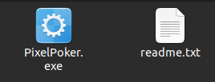
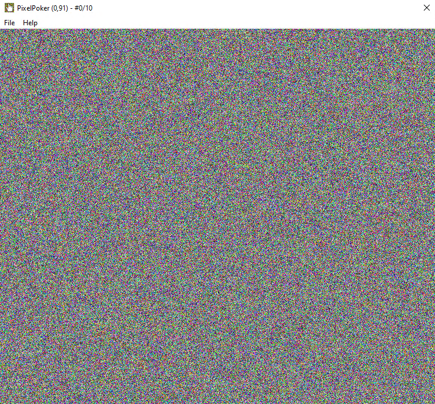
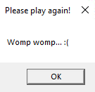
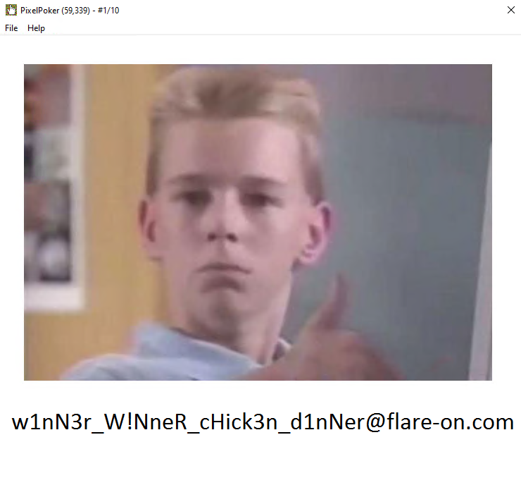

## Les fichiers

Le challenge se compose de deux fichiers:



Dans le fichier readme.txt, je trouve ce texte:

```text
Welcome to PixelPoker ^_^, the pixel game that's sweeping the nation!

Your goal is simple: find the correct pixel and click it

Good luck!
```

Et lors de l’exécution du programme, j'obtiens cette fenêtre:



En cliquant 10 fois dans cette fenêtre, une nouvelle fenêtre me demandant de réessayer avec le message "Womp womp... :(" apparaît:



## Le désassemblement

En parcourant l’exécutable avec Ghidra, je tombe rapidement sur ce morceau de code dans la fonction `FUN_004012c0` :

```C
if (param_2 == 0x201) {
      uVar8 = param_4;
      uVar6 = sVar1;
      if (NB_ESSAI == 10) {
        MessageBoxA(0x0,"Womp womp... :(","Please play again!",0);
        DestroyWindow(param_1);
      }
      else {
        NB_ESSAI = NB_ESSAI + 1;
        if ((uVar8 == s_FLARE-On_00412004._0_4_ % cx_00413280) &&
           (uVar6 == s_FLARE-On_00412004._4_4_ % cy_00413284)) {
          if (0 < cy_00413284) {
            iVar9 = 0;
            iVar4 = cx_00413280;
            iVar5 = cy_00413284;
            do {
              iVar7 = 0;
              if (0 < iVar4) {
                do {
                  FUN_004015d0(iVar7,iVar9);
                  iVar7 = iVar7 + 1;
                  iVar4 = cx_00413280;
                  iVar5 = cy_00413284;
                } while (iVar7 < cx_00413280);
              }
              iVar9 = iVar9 + 1;
            } while (iVar9 < iVar5);
          }
        }
        else if ((uVar8 < cx_00413280) && (uVar6 < cy_00413284)) {
          FUN_004015d0(uVar8,uVar6);
        }
      }
```

On peut voir qu'une vérification est faites après avoir incrémenter le nombre d'essai dans la boucle `else`.

Vous pouvez essayer de trouver ce qu'elle fait. De mon côté je vais patcher l’exécutable pour enlever cette vérification avec Ghidra.

## La modification de l’exécutable (patch) avec Ghidra

De vais donc commencer par enlever la comparaison qui est faites avec `uVar6`.

En cliquant sur la variable, je peux voir que le code assembleur est le suivant:

```Assembly
CMP	EBX,EDX
```

Et je vais le transformer en:

```Assembly
NOP
```

Pour cela, je fais un clic droit sur code code assembleur -> `Patch Instruction` -> je mets `NOP` au lieu de `CMP` et je supprime le reste. Je fais entrer et voilà !

On peut voir dans la fenêtre qui affiche le pseudo-code que la comparaison a disparu:

```C
# Avant
if ((uVar8 == s_FLARE-On_00412004._0_4_ % cx_00413280) &&
           (uVar6 == s_FLARE-On_00412004._4_4_ % cy_00413284))
           
# Après
if (uVar8 == s_FLARE-On_00412004._0_4_ % cx_00413280)
```

La procédure est la même pour la comparaison de `uVar8`.

Une fois la deuxième comparaison `NOP`er et que la boucle `if` a complètement disparu, on peut exporter l’exécutable patché.
Pour cela, je vais dans `File` -> `Export Program` -> Pour le format, choisir `Original File` et mettez ce que vous voulez pour le fichier de sortie.

Ensuite, j'exécute le binaire modifié, je clique n'importe où dans la fenêtre et ...


Le flag s'affiche !

## Conclusion

C'était la première fois que je patchais un exécutable et c'était plutôt simple en fin de compte ! J'ai lu plusieurs Write-ups et ceux qui modifiait le binaire passent par gdb donc j'ai décidé de le faire avec Ghidra.