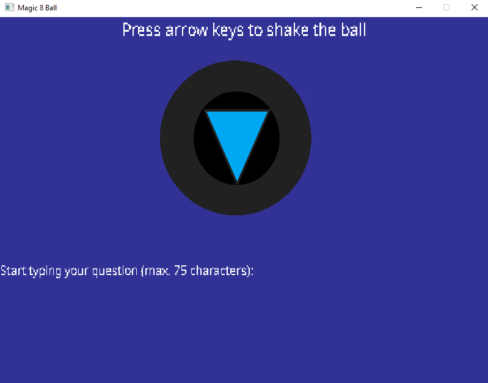
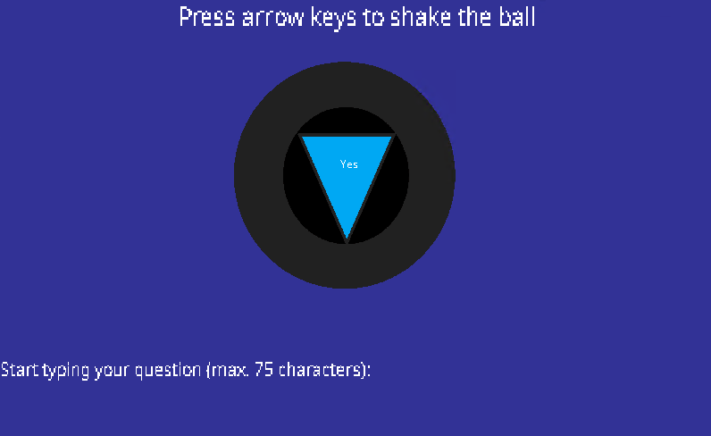

Le challenge est composé d'un exécutable `Magic8Ball.exe`, de fichiers `.dll` et d'un dossier `assets` qui héberge une image et des fichiers de police d'écriture.

Lors de l'exécution du programme, une fenêtre `Magic 8 Ball` s'ouvre et me demande de taper une question et de secouer la boule grâce aux flèches directionnelles du clavier.



Si je secoue la boule et que je tape une question, du texte apparaît dans le triangle bleu inversé:

- Don't count on it,
- My sources say no,
- Yes definitely,
- As I see it, yes,
- It is decidedly so,
- You may rely on it,
- It is certain,
- Cannot predict now,
- Most likely,
- Better not tell you now,
- Ask again later
- Without a doubt

## Le désassemblage

En parcourant l’exécutable avec Ghidra, je tombe sur ce code dans la fonction `FUN_004024e0`:

```C
(...)
  if (*(param_1 + 0x159) != '\0') {
    uVar1 = *(param_1 + 0x124);
    ppcVar4 = this;
    if (0xf < uVar1) {
      ppcVar4 = *this;
    }
    if (*ppcVar4 == 'L') {
      ppcVar4 = this;
      if (0xf < uVar1) {
        ppcVar4 = *this;
      }
      if (*(ppcVar4 + 1) == 'L') {
        ppcVar4 = this;
        if (0xf < uVar1) {
          ppcVar4 = *this;
        }
        if (*(ppcVar4 + 2) == 'U') {
          ppcVar4 = this;
          if (0xf < uVar1) {
            ppcVar4 = *this;
          }
          if (*(ppcVar4 + 3) == 'R') {
            ppcVar4 = this;
            if (0xf < uVar1) {
              ppcVar4 = *this;
            }
            if (*(ppcVar4 + 1) == 'U') {
              ppcVar4 = this;
              if (0xf < uVar1) {
                ppcVar4 = *this;
              }
              if (*(ppcVar4 + 5) == 'L') {
                ppcVar4 = this;
                if (0xf < uVar1) {
                  ppcVar4 = *this;
                }
                if (*(ppcVar4 + 6) == 'D') {
                  ppcVar4 = this;
                  if (0xf < uVar1) {
                    ppcVar4 = *this;
                  }
                  if (*(ppcVar4 + 7) == 'U') {
                    ppcVar4 = this;
                    if (0xf < uVar1) {
                      ppcVar4 = *this;
                    }
                    if (*(ppcVar4 + 2) == 'L') {
                      _Str1 = param_1 + 0xf8;
                      if (0xf < *(param_1 + 0x10c)) {
                        _Str1 = *_Str1;
                      }
                      iVar2 = strncmp(_Str1,param_1 + 0x5c,0xf);
                      if (iVar2 == 0) {
                        FUN_00401220(&stack0xffffffc0,this);
                        FUN_00401a10(param_1,in_stack_ffffffc0);
                      }
                    }
                  }
                }
              }
            }
          }
        }
      }
    }
```

On peut déduire que les lettres L,U,D,R peuvent être traduit en "Left", "Up", "Down", "Right" et que cette enchaînement de `if` est en réalité une séquence pour se rapprocher de l'obtention du flag. Et on peut le vérifier directement en exécutant le programme:



En secouant le boule dans cette ordre: gauche, gauche, haut, droit, haut, gauche, bas, haut, gauche et en mettant des caractères aléatoires. J'obtiens la réponse "Yes".

C'est pas le flag mais on s'en rapproche: il y a une vérification qui est réaliser avant de donner le flag:

```C
iVar2 = strncmp(_Str1,param_1 + 0x5c,0xf);
if (iVar2 == 0) {
    FUN_00401220(&stack0xffffffc0,this);
    FUN_00401a10(param_1,in_stack_ffffffc0);
}
```

Pour obtenir ce précieux flag, je vais faire comme le challenge précédent: je vais patcher le programme pour enlever la boucle `if`.
Pour cela, je vais modifier le code suivant:

```Assembly
JNZ LAB_00402789
```

En:

```Assembly
JZ LAB_00402789
```

En lançant le programme patcher et en exécutant la bonne séquence de secouage, j'obtiens le flag:


## Conclusion

Le plus long était de trouver la bonne séquence de secouage, ensuite je me suis pas fouler en patchant directement le programme 😊.