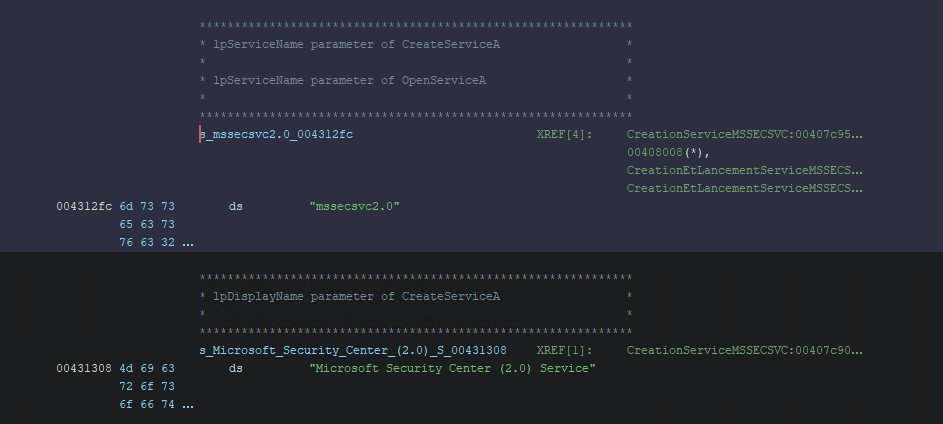

## Introduction

Je voulais me mettre à l'analyse de malware et pour cela je voulais en prendre un populaire: Wannacry.

Néanmoins, presque tous les blogs qui couvrent la rétro-ingénierie de ce ransomware s'arrêtent à l'url kill switch qui est au début du malware, sans aller plus loin.
J'ai donc décidé d'entreprendre la rétro-ingénierie du dropper de Wannacry en essayant d'écrire tout ce que je fais, tout ce que je trouve et tout ce que je déduis.
Il y a donc beaucoup de répétitions surtout au niveau des signatures des fonctions.

Si vous souhaitez suivre en lisant ce post, le dropper a comme sha256 `24d004a104d4d54034dbcffc2a4b19a11f39008a575aa614ea04703480b1022c`, de mon côté je l'ai trouvé sur [Malware Bazaar](https://bazaar.abuse.ch/sample/24d004a104d4d54034dbcffc2a4b19a11f39008a575aa614ea04703480b1022c/)

Aussi, sachez que je me suis aider, surtout au début, de [la première vidéo de Ghidra Ninja sur la rétro-ingénierie de ce malware](https://www.youtube.com/watch?v=Sv8yu12y5zM&themeRefresh=1 " Reversing WannaCry Part 1 - Finding the killswitch and unpacking the malware in #Ghidra").

## La fonction entry

Il n'y a pas de fonction main mais une fonction entry dans la liste des fonctions de ghidra:


La fonction entry ressemble à ceci, seul la dernière ligne est essentielle car c'est la fonction main qui s'appelle `FUN_00408140()` mais qui sera renommée dans l'avenir en `wWinMain()` car c'est comme cela que s'appelle [le point d'entrée des applications en C++](https://learn.microsoft.com/fr-fr/windows/win32/learnwin32/winmain--the-application-entry-point "WinMain : point d’entrée de l’application").

```C
void entry(void)

{
  undefined4 *puVar1;
  uint uVar2;
  HMODULE pHVar3;
  byte *pbVar4;
  undefined4 uVar5;
  char **local_74;
  _startupinfo local_70;
  int local_6c;
  char **local_68;
  int local_64;
  _STARTUPINFOA local_60;
  undefined *local_1c;
  void *pvStack_14;
  undefined *puStack_10;
  undefined *puStack_c;
  undefined4 local_8;
  
  puStack_c = &DAT_0040a1a0;
  puStack_10 = &DAT_00409ba2;
  pvStack_14 = ExceptionList;
  local_1c = &stack0xffffff78;
  local_8 = 0;
  ExceptionList = &pvStack_14;
  __set_app_type(2);
  _DAT_0070f894 = 0xffffffff;
  _DAT_0070f898 = 0xffffffff;
  puVar1 = __p__fmode();
  *puVar1 = DAT_0070f88c;
  puVar1 = __p__commode();
  *puVar1 = DAT_0070f888;
  _DAT_0070f890 = *_adjust_fdiv_exref;
  FUN_00409ba1();
  if (_DAT_00431410 == 0) {
    __setusermatherr(&LAB_00409b9e);
  }
  FUN_00409b8c();
  _initterm(&DAT_0040b00c,&DAT_0040b010);
  local_70.newmode = DAT_0070f884;
  __getmainargs(&local_64,&local_74,&local_68,_DoWildCard_0070f880,&local_70);
  _initterm(&DAT_0040b000,&DAT_0040b008);
  pbVar4 = *_acmdln_exref;
  if (*pbVar4 != 0x22) {
    do {
      if (*pbVar4 < 0x21) goto LAB_00409b09;
      pbVar4 = pbVar4 + 1;
    } while( true );
  }
  do {
    pbVar4 = pbVar4 + 1;
    if (*pbVar4 == 0) break;
  } while (*pbVar4 != 0x22);
  if (*pbVar4 != 0x22) goto LAB_00409b09;
  do {
    pbVar4 = pbVar4 + 1;
LAB_00409b09:
  } while ((*pbVar4 != 0) && (*pbVar4 < 0x21));
  local_60.dwFlags = 0;
  GetStartupInfoA(&local_60);
  if ((local_60.dwFlags & 1) == 0) {
    uVar2 = 10;
  }
  else {
    uVar2 = local_60.wShowWindow;
  }
  uVar5 = 0;
  pHVar3 = GetModuleHandleA(0x0);
  local_6c = FUN_00408140(pHVar3,uVar5,pbVar4,uVar2);
                    /* WARNING: Subroutine does not return */
  exit(local_6c);
}
```

Aussi, j'en profite pour ajouter à cette fonction `wWinMain()` ses paramètres qui sont trouvable dans la documentation de Microsoft:

```C
int WINAPI wWinMain(HINSTANCE hInstance, HINSTANCE hPrevInstance, PWSTR pCmdLine, int nCmdShow);
```

## La fonction vWinMain

Ensuite, la fonction `wWinMain()` est la suivante:

```C
undefined4 WinMain(void)

{
  undefined4 uVar1;
  int iVar2;
  undefined4 *puVar3;
  undefined4 *puVar4;
  undefined4 uStack_64;
  undefined4 uStack_60;
  undefined4 uStack_5c;
  undefined4 local_50 [14];
  undefined4 local_17;
  undefined4 local_13;
  undefined4 local_f;
  undefined4 local_b;
  undefined4 local_7;
  undefined2 local_3;
  undefined local_1;
  
  puVar3 = s_http://www.iuqerfsodp9ifjaposdfj_004313d0;
  puVar4 = local_50;
  for (iVar2 = 0xe; iVar2 != 0; iVar2 = iVar2 + -1) {
    *puVar4 = *puVar3;
    puVar3 = puVar3 + 1;
    puVar4 = puVar4 + 1;
  }
  *puVar4 = *puVar3;
  local_17 = 0;
  local_13 = 0;
  local_f = 0;
  local_b = 0;
  local_7 = 0;
  local_3 = 0;
  uStack_5c = 0;
  uStack_60 = 0;
  uStack_64 = 0;
  local_1 = 0;
  uVar1 = InternetOpenA(0,1);
  iVar2 = InternetOpenUrlA(uVar1,&uStack_64,0,0,0x84000000,0);
  if (iVar2 == 0) {
    InternetCloseHandle(uVar1);
    InternetCloseHandle(0);
    FUN_00408090();
    return 0;
  }
  InternetCloseHandle(uVar1);
  InternetCloseHandle(iVar2);
  return 0;
}
```

Ici, on trouve l'url "hxxp://www.iuqerfsodp9ifjaposdfjhgosurijfaewrwergwea\[.\]com" qui est l'url kill switch découverte par Marcus Hutchins et qui a permis d'arrêter la propagation du ransomware en achetant ce nom de domaine.

Dans cette fonction, je trouve aussi les fonctions `InternetOpenA`, `InternetOpenUrlA` et `InternetCloseHandle`. Auxquelles je mets à jour leurs signatures pour y voir un peu plus clair.

Pour `InternetOpenA`:

```C
HINTERNET InternetOpenA(
  LPCSTR lpszAgent,
  DWORD  dwAccessType,
  LPCSTR lpszProxy,
  LPCSTR lpszProxyBypass,
  DWORD  dwFlags
);
```

Pour `InternetOpenUrlA`:

```C
HINTERNET InternetOpenUrlA(
  HINTERNET hInternet,
  LPCSTR    lpszUrl,
  LPCSTR    lpszHeaders,
  DWORD     dwHeadersLength,
  DWORD     dwFlags,
  DWORD_PTR dwContext
);
```

Pour `InternetCloseHandle`:

```C
BOOL InternetCloseHandle(
  HINTERNET hInternet
);
```

Néanmoins, HINTERNET n'est pas un type de données conventionnel, je dois donc l'ajouter manuellement et je lui attribue le type `void *` . Pour être franc, je ne sais pas pourquoi il faut lui attribuer ce type. Après avoir fait quelques recherches, d'après [cette documentation](https://learn.microsoft.com/fr-fr/windows/win32/winprog/windows-data-types "Documentation Microsoft - Windows data types"), les LPVOID sont utilisés "vers n’importe quel type".

## La création du service mssecsvc2.0

Maintenant la fonction `FUN_00408090()`:

```C
void FUN_00408090(void)

{
  int *piVar1;
  SC_HANDLE hSCManager;
  SC_HANDLE hSCObject;
  SERVICE_TABLE_ENTRYA SStack_10;
  undefined4 uStack_8;
  undefined4 uStack_4;
  
  GetModuleFileNameA(0x0,&lpFilename_0070f760,0x104);
  piVar1 = __p___argc();
  if (*piVar1 < 2) {
    FUN_00407f20();
    return;
  }
  hSCManager = OpenSCManagerA(0x0,0x0,0xf003f);
  if (hSCManager != 0x0) {
    hSCObject = OpenServiceA(hSCManager,s_mssecsvc2.0_004312fc,0xf01ff);
    if (hSCObject != 0x0) {
      FUN_00407fa0(hSCObject,0x3c);
      CloseServiceHandle(hSCObject);
    }
    CloseServiceHandle(hSCManager);
  }
  SStack_10.lpServiceName = s_mssecsvc2.0_004312fc;
  SStack_10.lpServiceProc = &LAB_00408000;
  uStack_8 = 0;
  uStack_4 = 0;
  StartServiceCtrlDispatcherA(&SStack_10);
  return;
}
```

Ici, on voit que le ransomware récupère le nombre d’arguments grâce à `__p___argc()` ([documentation](https://learn.microsoft.com/fr-fr/cpp/c-runtime-library/argc-argv-wargv?view=msvc-170)) et si il y a moins de deux alors il rentre dans `FUN_00407f20`.

Et surtout il va créer un service, on peut le voir grâce à `OpenSCManagerA` et `OpenServiceA`, il pourrait juste interagir avec un service existant néanmoins j'ai vu les fonctions `CreateServiceA` et `StartServiceA` dans `FUN_00407f20` et c'est grâce à l'appel à ses deux fonctions que j'ai déduis qu'il crée et non qu'il interagit avec un service existant 😉.

Le nouveau service s'appelle `mssecsvc2.0` et a comme description `Microsoft Security Center (2.0) Service`:



Ensuite, il est configuré toujours dans `FUN_00407f20` :

```C
hService = CreateServiceA(hSCManager,s_mssecsvc2.0_004312fc,
                           s_Microsoft_Security_Center_(2.0)_S_00431308,0xf01ff,0x10,2,1,
                           cheminVersBinaire,0x0,0x0,0x0,0x0,0x0);
```

Cette fois-ci, je ne mets pas toute la fonction car ça ne va pas être utile. Donc, on peut voir les paramètres du nouveau service:

- il a comme accès 0xf01ff soit [SERVICE\_ALL\_ACCESS](https://learn.microsoft.com/fr-fr/windows/win32/services/service-security-and-access-rights) (donc un accès total),
- le type du service 0x10 soit SERVICE\_WIN32\_OWN_PROCESS, c'est donc un "[service qui s’exécute dans son propre processus](https://learn.microsoft.com/fr-fr/windows/win32/api/winsvc/nf-winsvc-createservicea)",
- l'option de démarrage qui est 2 soit SERVICE\_AUTO\_START,
- ce qu'il faut faire si le service ne démarre pas, ici c'est 1 soit SERVICE\_ERROR\_NORMAL ce qui signifie qu'il enregistre l'erreur dans le journal d’événements,
- on lui donne aussi un chemin vers un binaire mais ça je ne l'ai pas trouvé,
- 0x0 -> il ne fait pas partit d'un groupe,
- 0x0 -> pas de modification de la balise existante (je ne suis pas sûr de ce que ça signifie),
- 0x0 -> il n'y a pas de services qui doivent démarrer avant celui-ci,
- 0x0 -> Utilise le compte LocalSystem pour exécuter le service,
- 0x0 -> le mot de passe du compte spécifié , ici LocalSystem, il n'en a pas.

Ensuite, si la création se fait sans erreur, le service est lancé grâce à `StartServiceA` (toujours dans `FUN_00407f20`):

```C
if (hService != 0x0) {
    StartServiceA(hService,0,0x0);
    CloseServiceHandle(hService);
}
```

Après la création du service, il y a une autre fonction qui se nomme `FUN_00407ce0` et qui est beaucoup trop grande pour que je la copie ici et je ne suis vraiment pas sûr de ce qu'elle fait. Néanmoins, je peux en extraire deux chemins (enfin ça y ressemble):

- "C:\\%s\\qeriuwjhrf"
- "C:\\%s\\%s"

Aussi, des fichiers y sont déplacés:

```C
MoveFileExA(&cStack_208,&cStack_104,1)
```

Et c'est à peut prêt tout !

## Conclusion

On a vu ce que faisait ce dropper: il vérifie une URL, si l'URL n'est pas atteignable alors il va créer le service `mssecsvc2.0` qui va *surement* télécharger le ransomware.